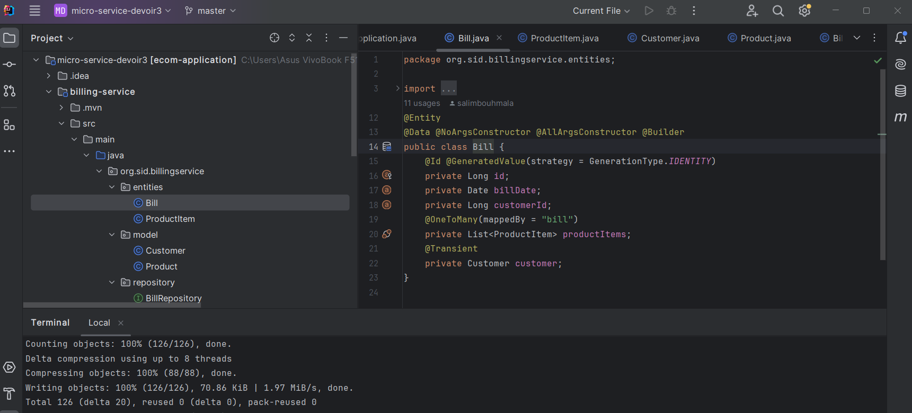
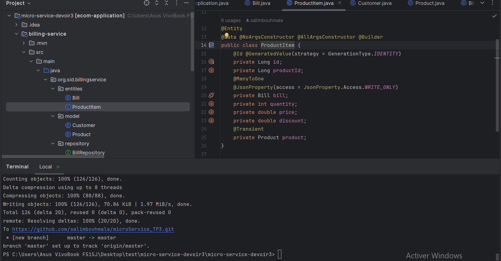
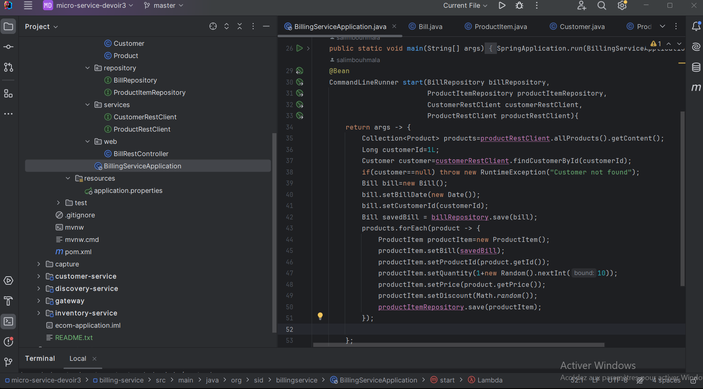
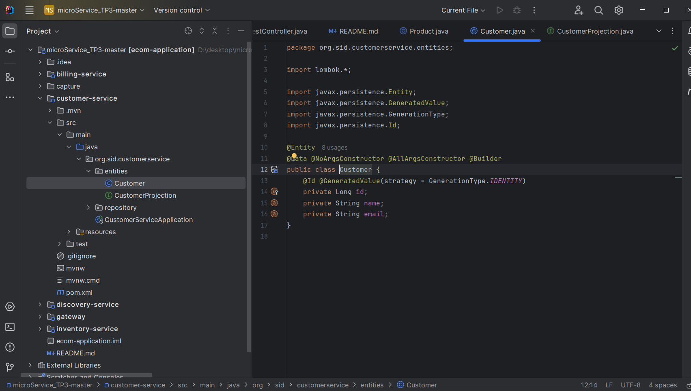
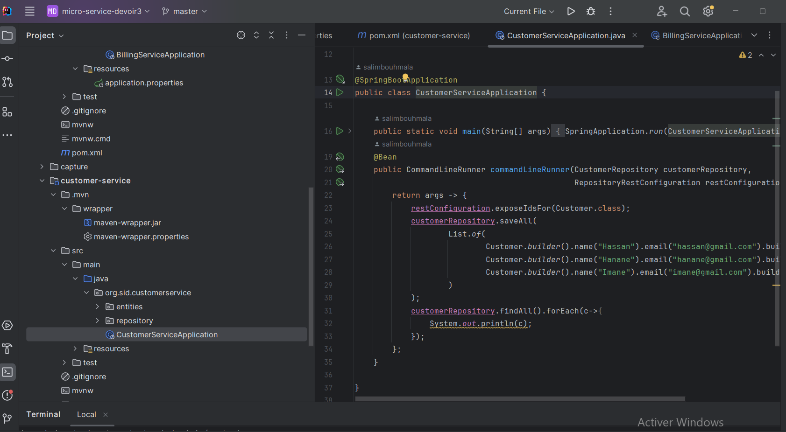
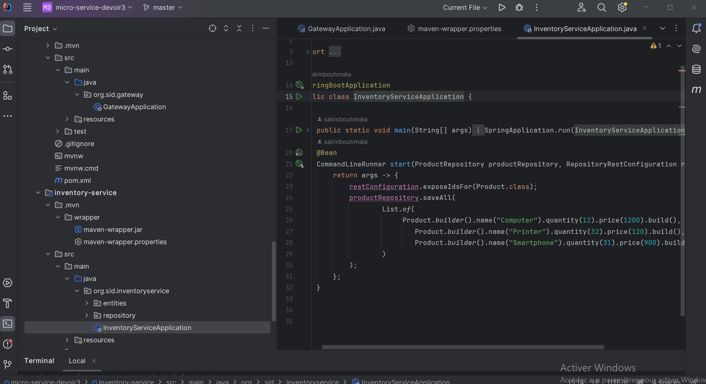
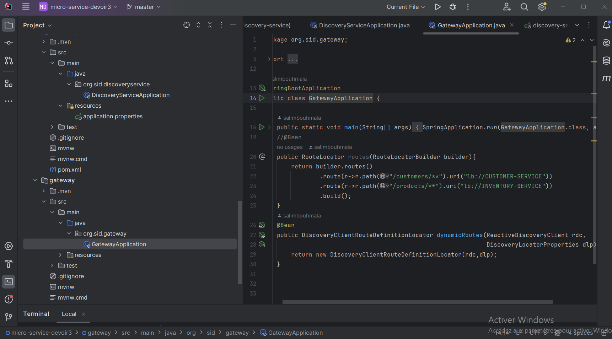
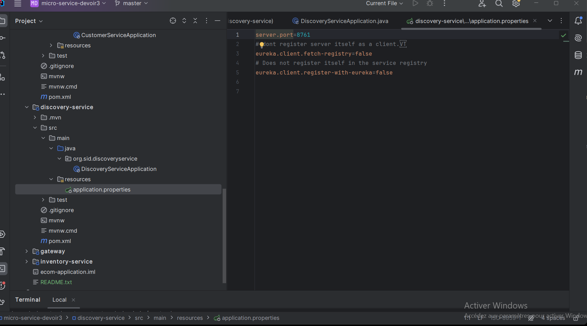
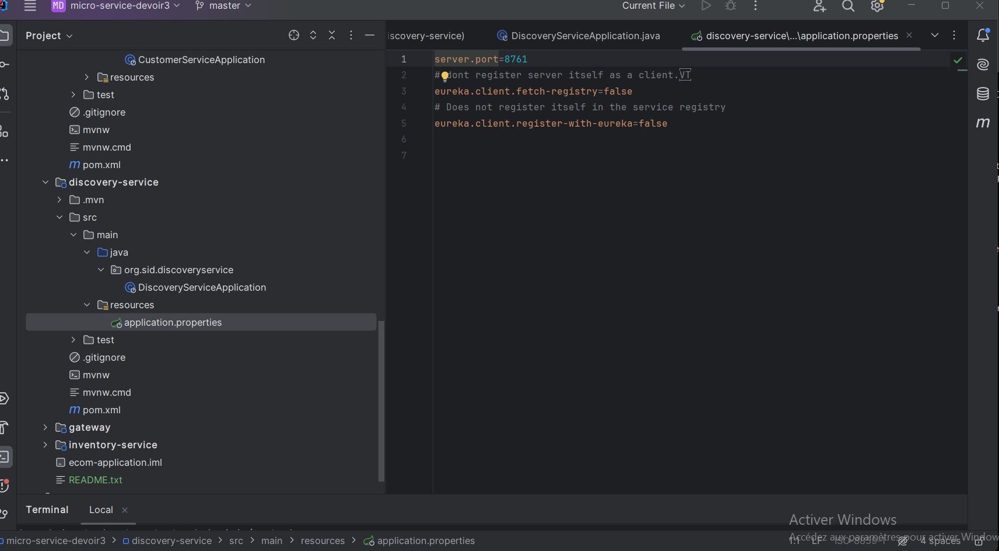

<h3>TP 3</h3>

<h1> Microservices screenshot:</h1>

<ul>
<li>Billing Entity </li>

<li>Product Item Entity </li>

<li>Product Entity </li>

<li>Customer Entity </li>

<li>Billing service </li>

<li>Custumor service</li>

<li>Inventory service </li>

<li>Gateway </li>

<li>Discovery Service </li>

</ul>